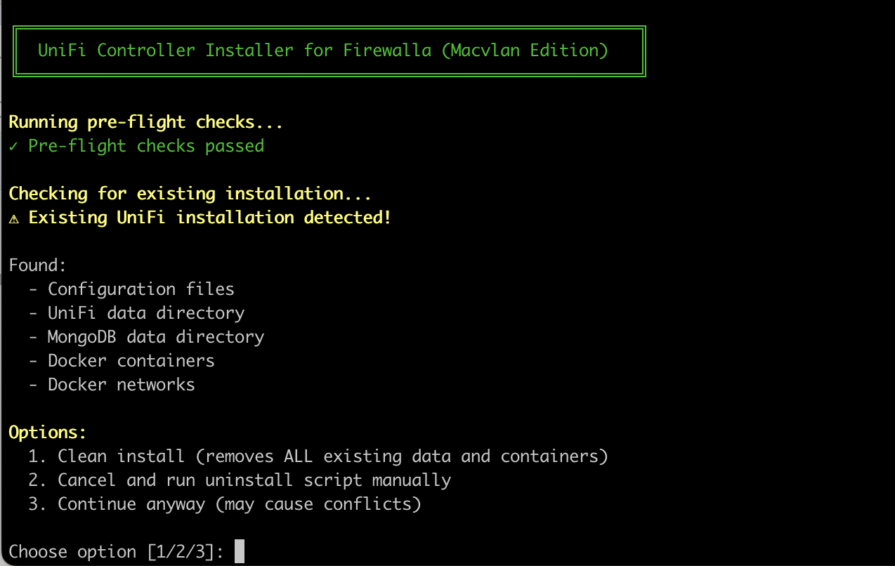
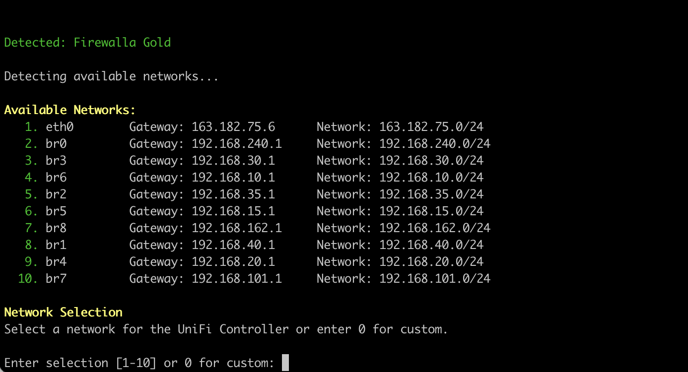
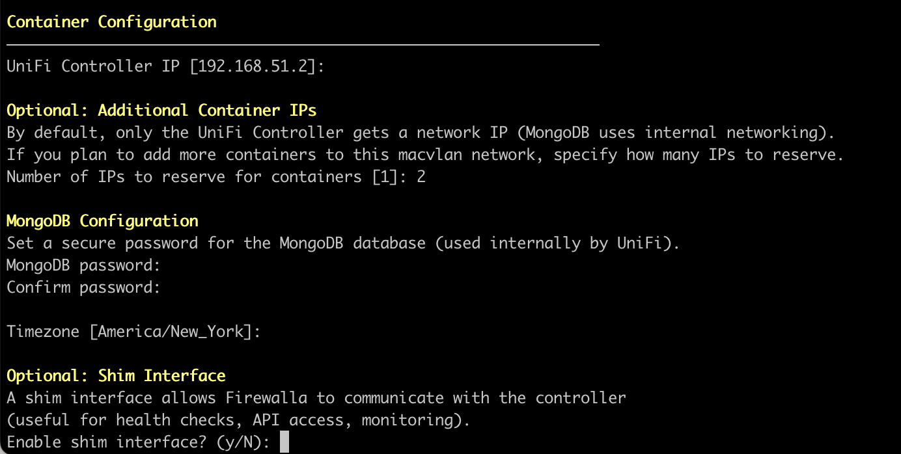
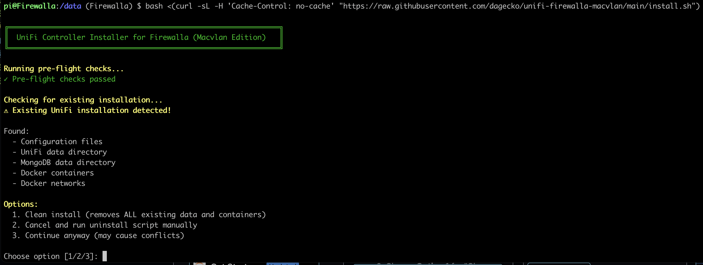
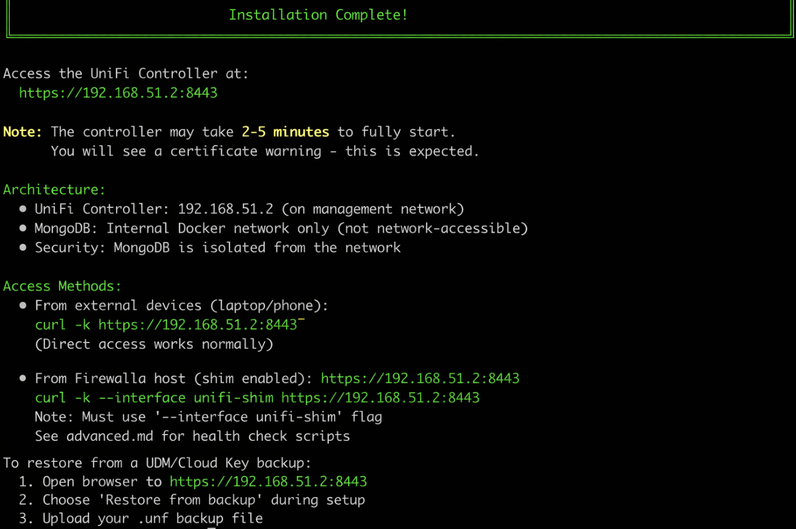
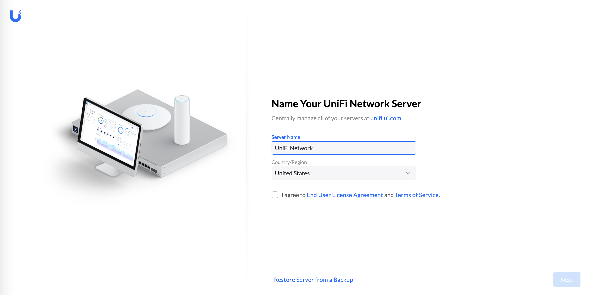

# UniFi Controller on Firewalla Gold Pro (Macvlan Setup)

Install UniFi Network Application in Docker on Firewalla Gold Series boxes using macvlan networking. This places the controller directly on your management network rather than an isolated Docker bridge network.

## Why Macvlan Over Bridge Networking?

Most UniFi-on-Firewalla guides use a separate Docker bridge network (172.16.1.0/24), requiring routing tricks and inform URL changes. This macvlan approach puts the controller directly on your existing management network with significant advantages:

### Performance & Efficiency
- **Near-native performance**: Direct L2 network access eliminates Docker NAT overhead
- **Lower latency**: No bridge forwarding delays for device communications
- **Reduced CPU usage**: Fewer iptables rules and packet processing

### Security & Isolation
- **True network segmentation**: Controller lives on management VLAN, not shared bridge
- **Policy enforcement**: Firewalla ACLs apply directly to controller traffic
- **Cleaner firewall rules**: No complex Docker bridge NAT rules to maintain
- **Better visibility**: Traffic appears as real network traffic in Firewalla analytics

### Migration & Operations
- **Seamless UDM/Cloud Key migration**: Devices stay on same L2 network
- **No inform URL changes**: Backup restoration works without reconfiguring devices
- **Enterprise architecture**: Matches out-of-band management best practices
- **Easier troubleshooting**: Standard network tools work (ping, traceroute, etc.)

### Bridge Networking Trade-offs
- **Simpler initial setup** (but more complex long-term maintenance)
- **More portable** (works without network changes, but at cost of isolation)
- **Easier for beginners** (familiar Docker patterns, but less optimal for production)

**Verdict**: For production UniFi deployments on Firewalla, macvlan is the superior choice. Bridge networking is acceptable for testing but not recommended for long-term use.

## Requirements

- Firewalla Gold, Gold SE, Gold Plus, or Gold Pro (not recommended for Purple series due to memory constraints)
- SSH access to your Firewalla
- A dedicated management network/VLAN (e.g., 192.168.240.0/24)
- One available IP address for the UniFi Controller

## Architecture

```
ISP → Firewalla Gold Pro
        ├── Management Network (e.g., 192.168.240.0/24)
        │     ├── Firewalla (192.168.240.1)
        │     ├── UniFi Controller Docker (192.168.240.2) ← macvlan
        │     └── UniFi APs/Switches (management interfaces)
        ├── User Network (e.g., 192.168.1.0/24)
        └── IoT/Camera Networks (as needed)

Internal Docker Network (not exposed to network):
        └── MongoDB ← only accessible by UniFi Controller
```

### Intelligent Network Detection and Adaptive Deployment

The installation script automatically detects your network type and deploys the optimal architecture:

**Native LAN Networks** (e.g., 192.168.101.0/24 on br7):
- **Detection**: Bridge interface uses physical interface without VLAN tag (like `eth1`)
- **Container count**: 2 (unifi + unifi-db)
- **Routing**: Works automatically with standard macvlan - no additional configuration needed
- **Why it works**: Docker correctly sets default route to macvlan gateway on native LANs
- **Best for**: Home networks, testing environments, simpler Firewalla setups

**VLAN Networks** (e.g., 192.168.240.0/24 on br0):
- **Detection**: Bridge interface uses VLAN-tagged subinterface (like `eth1.240`)
- **Container count**: 3 (unifi + unifi-db + routing-fixer sidecar)
- **Routing**: Requires self-healing sidecar container plus policy routing rule
- **Why needed**: Docker's multi-network containers always default route via first network (internal bridge) instead of macvlan, breaking connectivity on VLANs
- **Best for**: Production deployments, enterprise VLANs, proper network segmentation

**The VLAN Routing Problem:**

When Docker attaches a container to multiple networks (internal bridge for MongoDB + macvlan for your network), it creates the default route via the internal bridge (`eth0`) instead of the macvlan interface (`eth1`). On VLAN networks, this causes two critical issues:

1. **Container routing**: Outbound traffic tries to use internal bridge gateway (doesn't exist) instead of VLAN gateway
2. **Firewalla policy routing**: Reply packets can be sent to WAN interface instead of back to source VLAN

**The Self-Healing Sidecar Solution:**

For VLAN deployments, the script automatically deploys a routing-fixer sidecar container:

- **Technology**: [nicolaka/netshoot](https://github.com/nicolaka/netshoot) container (8.3k GitHub stars, widely trusted in network engineering community)
- **Author**: Nicola Kabar (Docker Captain, AWS Solutions Architect)
- **Purpose**: Pre-built network troubleshooting toolkit with iproute2 and networking tools
- **Size**: ~20MB compressed, minimal resource overhead
- **Security**:
  - Only has NET_ADMIN capability for routing commands
  - Shares network namespace only (cannot access UniFi filesystem or processes)
  - Open source and auditable

**How the sidecar works:**
```
Every 10 seconds:
  1. Check if default route points to eth1 (macvlan interface)
  2. If NO: Delete incorrect route via eth0, add correct route via eth1
  3. If YES: Do nothing, continue monitoring
  4. Repeat
```

**Additional Firewalla host configuration:**
```bash
# Policy routing rule (applied automatically by install script)
ip rule add from 192.168.240.0/24 lookup lan_routable priority 5002
```
This ensures reply packets use the correct routing table and return via the VLAN interface instead of WAN.

**Why sidecar instead of alternatives:**

- **vs Startup script with nsenter**: Sidecar is self-healing - automatically fixes routing after container restarts
- **vs Manual routing**: Docker-native solution managed by docker-compose
- **vs Complex iptables**: Simpler, more maintainable, easier to troubleshoot
- **Observability**: `docker logs unifi-routing-fixer` shows routing fixes in real-time

**Decision Guide:**

Choose your network based on your Firewalla setup:
- **Native LAN**: If your management network is on br7 (or main LAN without VLANs)
- **VLAN**: If your management network is on a dedicated VLAN (recommended for production)

The script handles all complexity automatically - you just select the network and it deploys the right architecture!

## Screenshots

### Installation Process


*Starting the installation script*


*Selecting network configuration with visual interface list*


*Configuring MongoDB password and shim interface*


*Reviewing configuration before installation*


*Installation completed successfully*

### UniFi Controller Setup


*UniFi Network Application setup wizard*

## Prerequisites

### Firewalla Network Setup

**Before running the installation script**, ensure your Firewalla network is properly configured:

#### 1. Create Your Management Network

Choose one of these approaches:

**Option A: Native LAN (Simpler)**
- Use an existing LAN network (e.g., br7 on 192.168.101.0/24)
- No VLAN configuration needed
- Best for: Home networks, testing, simple setups

**Option B: Dedicated VLAN (Recommended for Production)**
- Create a management VLAN in Firewalla UI (e.g., VLAN 240 on 192.168.240.0/24)
- Ensure the VLAN is active and reachable
- Best for: Production deployments, proper network segmentation

#### 2. Configure Firewall Rules

**If using separate VLANs for management and devices:**

In Firewalla UI, create rules to allow traffic between your device network and management network:

```
Example:
Device VLAN (192.168.101.0/24) → Management VLAN (192.168.240.0/24)
Ports: 8080 (inform), 8443 (UI), 3478 (STUN)
```

**Key ports to allow:**
- `8080/tcp` - UniFi inform protocol (device → controller communication)
- `8443/tcp` - UniFi web UI (your device → controller UI)
- `8443/tcp` - Device management (controller → device management)
- `3478/udp` - STUN (for UniFi Talk/Protect if used)

**Note:** If your management network is an "enclave" (isolated network), ensure you configure appropriate rules to allow the above traffic.

#### 3. Reserve IP Address

Ensure you have at least one free IP address on your management network for the UniFi Controller. Consider using a static IP outside your DHCP range (e.g., 192.168.240.2).

### UniFi Device Auto-Discovery (Optional but Recommended)

For UniFi devices to automatically discover the controller without manual adoption:

#### Configure DHCP Option 43

In **Firewalla UI** → **Network Manager** → **Network** → Select your **device network** (where UniFi APs/switches live):

1. Scroll to **DHCP Server** section
2. Add **DHCP Option 43** with format: `01:04:c0:a8:f0:02`
   - `01` = suboption (UniFi discovery)
   - `04` = length (4 bytes for IPv4)
   - `c0:a8:f0:02` = controller IP in hex (e.g., 192.168.240.2)

**Converting IP to hex:**
```bash
# Example: 192.168.240.2
192 = c0
168 = a8
240 = f0
2   = 02
# Result: 01:04:c0:a8:f0:02
```

**Hex conversion table for common octets:**
```
1=01, 2=02, 10=0a, 50=32, 100=64, 101=65
150=96, 168=a8, 192=c0, 240=f0, 254=fe
```

**Example configurations:**
- `192.168.1.10` → `01:04:c0:a8:01:0a`
- `192.168.101.2` → `01:04:c0:a8:65:02`
- `10.0.50.100` → `01:04:0a:00:32:64`

3. Click **Save** (don't forget this step!)

**Verification:**
```bash
# On Firewalla, check dnsmasq config
grep -r "dhcp-option.*43" /home/pi/.firewalla/config/dnsmasq*/

# Should show: dhcp-option=net:<network>,43,01:04:c0:a8:f0:02
```

#### Alternative: Manual Device Adoption

Without DHCP Option 43, you can manually adopt devices:

1. SSH to UniFi device: `ssh ubnt@<device-ip>` (default password: `ubnt`)
2. Set inform URL: `set-inform http://<controller-ip>:8080/inform`
3. Adopt device in controller UI

**Note:** DHCP Option 43 is strongly recommended for larger deployments to avoid manual configuration of each device.

### Verification Checklist

Before installation, verify:

- [ ] Management network exists and is reachable
- [ ] IP address reserved for controller (e.g., 192.168.240.2)
- [ ] Firewall rules allow traffic between device network and management network (if separate)
- [ ] DHCP Option 43 configured on device network (if using auto-discovery)
- [ ] SSH access to Firewalla working

## Quick Install

SSH into your Firewalla and run:

```bash
bash <(curl -sL "https://raw.githubusercontent.com/dagecko/unifi-firewalla-macvlan/main/install.sh")
```

Or download and run:

```bash
curl -sL "https://raw.githubusercontent.com/dagecko/unifi-firewalla-macvlan/main/install.sh" -o /tmp/install.sh
bash /tmp/install.sh
```

The script will prompt you for:
- Network selection (use existing network or specify custom)
- Controller IP address
- MongoDB password (for internal use only - supports any special characters)
- Number of IPs to reserve (if you plan to add more containers)
- Timezone
- Optional: Shim interface for host access to controller from Firewalla

**Note:** After installation completes, the UniFi Controller may take 2-5 minutes to fully start up and become accessible.

## Manual Install

See [manual-install.md](manual-install.md) for step-by-step instructions.

## Post-Install

### First Access

Wait 2-5 minutes after installation for the UniFi Controller to fully start, then access it at:

```
https://<controller-ip>:8443
```

**From external devices (laptop, phone):** Direct access works immediately
```bash
# Example from your laptop
curl -k https://192.168.240.2:8443
```

**From Firewalla host (if shim enabled):** Must use the shim interface
```bash
# Example from Firewalla SSH session
curl -k --interface unifi-shim https://192.168.240.2:8443
```

You'll see a certificate warning (self-signed certificate) - this is expected.

### Migrating from UDM/Cloud Key

1. Access the controller at `https://<controller-ip>:8443`
2. During setup, choose **"Restore from backup"**
3. Upload your `.unf` backup file from the old controller
4. Update the inform URL in Settings → System → Advanced to `http://<controller-ip>:8080/inform`
5. Power cycle your UDM/Cloud Key to release the devices
6. Devices should automatically adopt to the new controller

## Updating

**Option 1: Using the update script (recommended)**

```bash
curl -sL "https://raw.githubusercontent.com/dagecko/unifi-firewalla-macvlan/main/update.sh" | bash
```

**Option 2: Manual update**

```bash
cd /home/pi/.firewalla/run/docker/unifi
sudo docker-compose pull
sudo docker-compose up -d
sudo docker system prune -f
```

## Uninstalling

```bash
curl -sL "https://raw.githubusercontent.com/dagecko/unifi-firewalla-macvlan/main/uninstall.sh" | bash
```

Or manually:

```bash
cd /home/pi/.firewalla/run/docker/unifi
sudo docker-compose down -v
sudo rm -rf /data/unifi /data/unifi-db
sudo rm -rf /home/pi/.firewalla/run/docker/unifi
sudo rm -f /home/pi/.firewalla/config/post_main.d/start_unifi.sh
```

## Important Notes

### Macvlan Limitation

Due to how macvlan works, the Firewalla host cannot directly communicate with containers on the macvlan network without a shim interface. This is expected Linux kernel behavior, not a bug.

**What this means:**
- External devices (laptops, phones, tablets) can access the controller directly at `https://192.168.240.2:8443`
- UniFi devices on the network can communicate with the controller normally
- Firewalla host cannot access the controller with regular `curl https://192.168.240.2:8443`
- **With shim enabled:** Firewalla host can access via `curl --interface unifi-shim https://192.168.240.2:8443`

If you need to access the controller from Firewalla itself (for health checks, API access, or monitoring scripts), enable the shim interface during installation or see [advanced.md](advanced.md) for manual setup.

### Network Security

MongoDB runs on an internal Docker bridge network and is **not** exposed to your management network. Only the UniFi Controller container can communicate with it. This follows the principle of least exposure and is more secure than exposing the database to the network.

### Resource Usage

The UniFi Network Application uses significant resources:
- ~800MB-1GB RAM
- ~800MB disk space (more with logs/backups over time)

Monitor with: `docker stats`

### Persistence

The install script creates `/home/pi/.firewalla/config/post_main.d/start_unifi.sh` to ensure Docker and the containers start after Firewalla reboots.

## Troubleshooting

### Container won't start
```bash
docker logs unifi
docker logs unifi-db
```

### MongoDB connection issues
Ensure MongoDB is healthy before UniFi starts:
```bash
docker ps
```
Both containers should show as "Up" with healthy status.

### Network unreachable
Verify macvlan network exists:
```bash
docker network ls
docker network inspect unifi_unifi-net
```

### Reset and start over
Run the uninstall script, then reinstall.

## Credits

- Based on [Firewalla's official UniFi guide](https://help.firewalla.com/hc/en-us/articles/360053441074)
- Inspired by [mbierman's unifi-installer-for-Firewalla](https://github.com/mbierman/unifi-installer-for-Firewalla)
- Uses [LinuxServer.io's UniFi Network Application image](https://github.com/linuxserver/docker-unifi-network-application)

## License

GPL-3.0

## Disclaimer

This script is provided as-is. It should not affect Firewalla's core router functionality or compromise security, but use at your own risk. Always maintain backups of your UniFi configuration.
